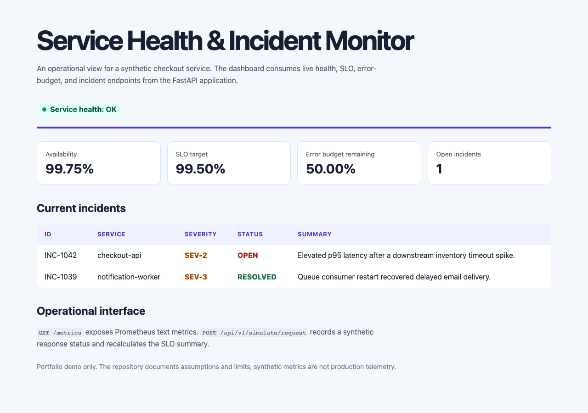

# Service Health & Incident Monitor

A runnable FastAPI service that models the operational concerns behind a cloud/platform role: health checks, Prometheus-compatible metrics, availability SLOs, error budgets, incidents, structured event logging, and a small dashboard backed by live API endpoints.

> **Scope note:** This project intentionally uses synthetic in-memory service events. It demonstrates how operational signals are exposed and reasoned about; it is not an actual production monitoring platform.



## What it demonstrates

- FastAPI HTTP service design, typed request validation, and live API testing.
- Separate liveness (`/healthz`) and readiness (`/readyz`) endpoints.
- Availability SLO and **process-lifetime synthetic** error-budget calculation for a 99.5% target.
- Prometheus 0.0.4 text-format metrics at `/metrics`, with HELP/TYPE metadata and a valid text content type.
- Incident context alongside quantitative signals, including open and resolved incidents.
- A synthetic fault-injection endpoint used to prove that service errors consume the calculated error budget.
- A browser dashboard that fetches live service data, not a static mock-up.

## Run locally

Requirements: Python 3.11+.

```bash
git clone https://github.com/mithulram/service-health-incident-monitor.git
cd service-health-incident-monitor
python3 -m venv .venv
source .venv/bin/activate
python -m pip install --upgrade pip
python -m pip install -e '.[test]'
DEMO_MODE=true uvicorn service_monitor.app:app --host 127.0.0.1 --port 8090
```

Visit [http://127.0.0.1:8090](http://127.0.0.1:8090) for the dashboard. API documentation is available at `/docs`.

## Live demo

| Service | URL |
|---|---|
| Backend API | https://service-health-incident-monitor.onrender.com |
| Companion dashboard | https://operations-dashboard-76xm.onrender.com |

After deploying your own instance, verify with:

```bash
BACKEND_URL=https://service-health-incident-monitor.onrender.com python scripts/smoke_backend.py
```

## Endpoint contract

| Endpoint | Purpose |
|---|---|
| `GET /healthz` | Lightweight liveness signal |
| `GET /readyz` | Readiness signal |
| `GET /api/v1/summary` | Request counts, availability, SLO target, error budget, open-incident count |
| `GET /api/v1/slo` | SLO-focused summary |
| `GET /api/v1/incidents` | Synthetic incident context |
| `POST /api/v1/simulate/request` | Record a synthetic status code when `DEMO_MODE=true` (disabled otherwise) |
| `GET /metrics` | Prometheus text-format metrics |

## Operational model

The monitor starts with 399 successful responses and 1 server error: 99.75% availability. For a 99.5% SLO target, that leaves 50% of the **process-lifetime synthetic** error budget. Recording a `5xx` response through the simulation endpoint lowers availability and consumes more of that budget. The calculation covers the in-memory lifetime of the demo process, not a calendar month.

```bash
DEMO_MODE=true uvicorn service_monitor.app:app --host 127.0.0.1 --port 8090

curl -X POST http://127.0.0.1:8090/api/v1/simulate/request \
  -H 'Content-Type: application/json' \
  -d '{"status_code":503}'

curl http://127.0.0.1:8090/metrics
```

## Verify

```bash
python -m unittest discover -s tests -v
python -m compileall -q src tests
```

The test suite checks health/readiness, SLO values, Prometheus response semantics, incident data, CORS behavior, and that an injected `503` reduces error-budget headroom.

### Deployed backend smoke test

After deploying, confirm the live API responds:

```bash
BACKEND_URL=https://your-service.onrender.com python scripts/smoke_backend.py
```

## Deploy for free (Render Web Service)

> **Demo only:** This service uses synthetic in-memory data. It is not a production monitoring platform and must not receive real credentials or live traffic.

Recommended host: [Render](https://render.com) Free Web Service (Python native runtime).

| Setting | Value |
|---|---|
| Build command | `python -m pip install --upgrade pip && python -m pip install .` |
| Start command | `uvicorn service_monitor.app:app --host 0.0.0.0 --port $PORT` |
| Health check path | `/healthz` |
| `DEMO_MODE` | `true` |
| `WEB_CORS_ORIGINS` | Comma-separated exact frontend origins (set after frontend deploy) |

A starter [`render.yaml`](render.yaml) Blueprint is included. When prompted for `WEB_CORS_ORIGINS`, enter the final frontend URL (for example `https://operations-dashboard.pages.dev`).

**Deployment order with the companion dashboard:**

1. Deploy this backend first and note the `https://*.onrender.com` URL.
2. Deploy the [operations-dashboard](https://github.com/mithulram/operations-dashboard) frontend with `VITE_API_BASE_URL` pointing at this backend.
3. Set `WEB_CORS_ORIGINS` to the frontend origin and redeploy this service.
4. Run the smoke test above.

**Docker (optional):** The included `Dockerfile` binds to `0.0.0.0` and uses port `8090` locally or `$PORT` when set:

```bash
docker build -t service-monitor .
docker run --rm -p 8090:8090 -e DEMO_MODE=true service-monitor
```

**CORS:** Cross-origin browser access is limited to origins listed in `WEB_CORS_ORIGINS`. When unset, local dev defaults apply: `http://localhost:5173` and `http://127.0.0.1:5173`. Wildcard `*` is not used.

## Design boundaries

- Data is in-memory so a fresh clone runs immediately; a production implementation would source events from logs, traces, or a metrics backend.
- The metrics output follows Prometheus's human-readable text exposition style but does not replace a Prometheus server, alert manager, or dashboard platform.
- The `simulate` endpoint is intentionally a demo/testing hook and would not be publicly exposed in production.

## Resume-ready description

> Built a FastAPI service-health monitor that exposes readiness and Prometheus-format metrics, calculates a 99.5% availability SLO and error budget, correlates incidents with operational signals, and verifies fault-injection effects through HTTP tests.

## License

MIT. See [LICENSE](LICENSE).
